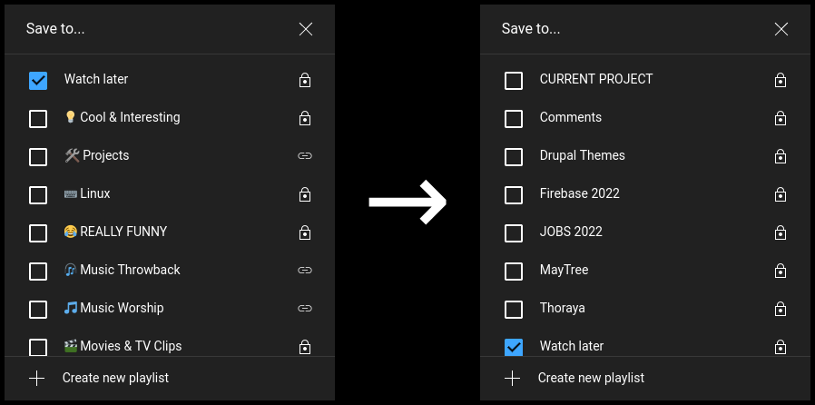

# Reorder YT Playlist Popup

## A TamperMonkey script to reorder list of playlists on YouTube
Check out the blog post about this project [here](https://danwm.xyz/2022/06/20/Script-for-sorting-playlists-on-YouTube/)

### Current YT Functionality
Clicking the "Save to playlist" or "Save" button opens a popup that lists all your playlists in "recently added" order.

### Functionality with this script
Clicking the "Save to playlist" or "Save" button TEXT opens the same popup, waits ~2s and displays the list in alphabetical order. The sorting does not affect event listeners or other element data.

> **_NOTE:_** Clicking on the icon of the button will not work as of version 0.1

## How To Install
 1. Get the TamperMonkey browser extension - https://www.tampermonkey.net/
 2. Create a new script and add the code from [ReorderYTPlaylists.js](ReorderYTPlaylists.user.js)
 3. Go to [YouTube](https://www.youtube.com) and test it by clicking on the TEXT of the button "Save to playlist" or "Save"

> Version 0.1 works on the latest stable version of Chrome and Firefox

## Future Features
 * Sorting the side panel playlist view
 * Section on page that holds buttons to control functionality (instead of using existing buttons)
 * Check if sorting has already happened instead of sorting every time the button is clicked.
 * Keep Watch later playlist at the top
 * Bypass unicode characters/icons as the first letter of the name (use only a-z and A-Z)

## Bugs or Features?
Create an issue with the appropriate tag and describe the bug or feature. If you want to submit a pull request with a fix then please reference the issue too.

## Known Issues
---
